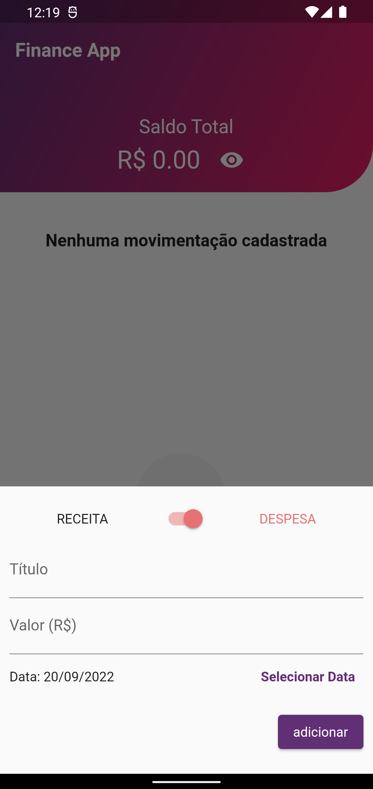
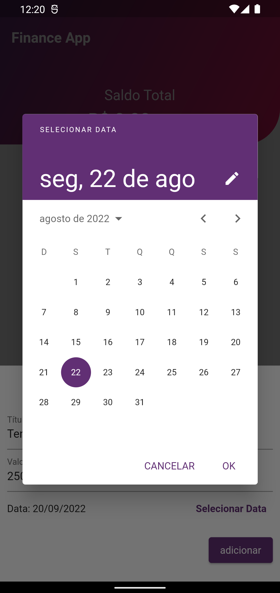
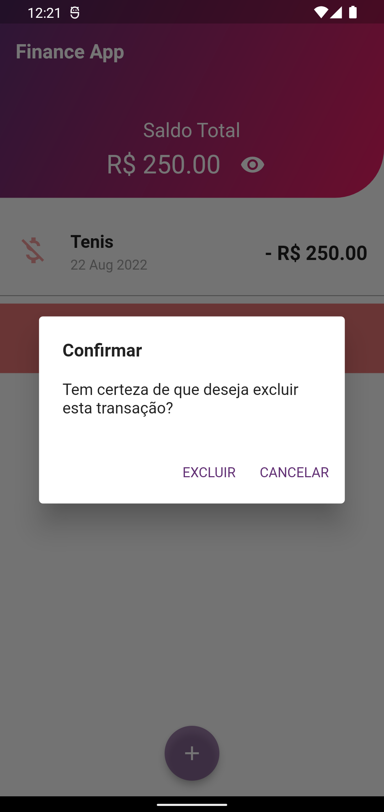

# 💵 Money Manager

 

## Sobre o projeto

App gerenciador de dinheiro, desenvolvido em Flutter com provider + testes unitários.
Nele é possível cadastrar todas as suas despesas e todas as suas receitas, armazenando-as localmente no celular.

## Layout mobile

### Tecnologias utilizadas

* Flutter
* Provider
* Testes Unitários

### Desenvolvedora

Jusy Lopes
https://www.linkedin.com/in/jusylopes

